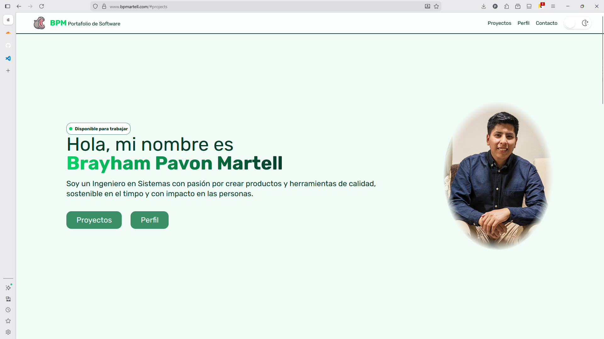
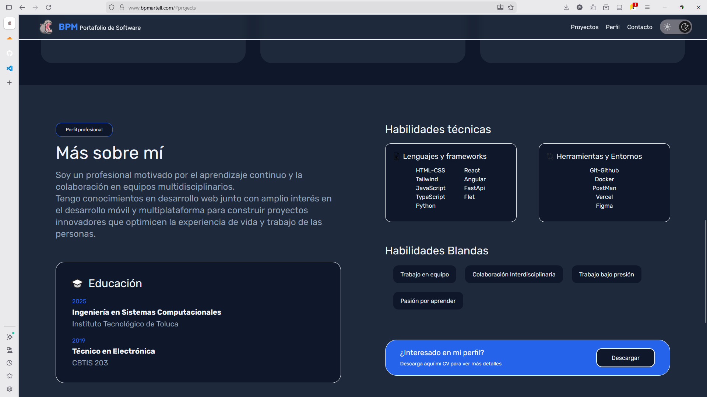
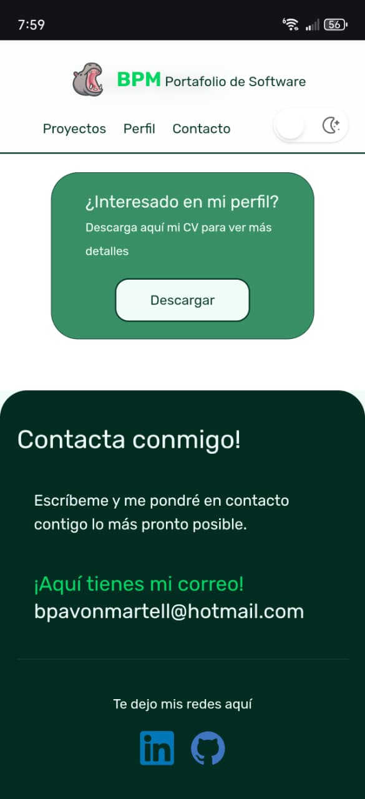

# Portafolio Profesional

Bienvenido al repositorio de mi portafolio profesional. Este proyecto representa la evolución de mi presencia en línea, destacando mis habilidades y proyectos más recientes.

## 🚀 Sobre el Proyecto

Esta es la tercera iteración de mi portafolio  de software reconstruida desde cero utilizando tecnologías modernas para garantizar rendimiento, escalabilidad y una excelente experiencia de desarrollador.

## 🛠️ Tecnologías

Este proyecto utiliza un stack moderno y eficiente:

-   **[React](https://react.dev/)**: Biblioteca para construir interfaces de usuario.
-   **[TypeScript](https://www.typescriptlang.org/)**: JavaScript con sintaxis para tipos, proporcionando mayor seguridad y mejor experiencia de desarrollo.
-   **[Vite](https://vitejs.dev/)**: Herramienta de build de próxima generación, extremadamente rápida.
-   **[Tailwind CSS](https://tailwindcss.com/)**: Framework de utilidades para un diseño rápido y responsivo.

## ✨ Funcionalidades

El portafolio incluye las siguientes secciones principales:

-   **Header**: Navegación principal.
-   **Intro**: Presentación inicial e impacto visual.
-   **Perfil**: Información profesional y personal.
-   **Proyectos**: Galería de trabajos realizados.
-   **Contacto**: Medios para contactarme.

## 📸 Galería

Aquí puedes ver algunas capturas del portafolio:

|  |  |
|:---:|:---:|
| *Vista General* | *Detalles de Proyectos* |

### Versión Móvil

## 🌐 Despliegue

La aplicación está desplegada y accesible globalmente gracias a **Cloudflare Pages** en el siguiente enlace: https://www.bpmartell.com

### Historia y Evolución

El proyecto ha pasado por varias etapas de maduración:

-   **v3: `ts-portforlio` (Versión Actual)**: La versión más avanzada, desarrollada con **React, TypeScript y Vite**. Se enfoca en el tipado estático, la velocidad de carga y una arquitectura de componentes modular.
-   **v2: `BPM_Portfolio`**: La transición a **React**. Introdujo la componentización y el manejo de estado, dejando atrás la estructura estática.
-   **v1: `BaseHTML`**: El comienzo. Una estructura simple basada en **HTML y CSS** puro, que sirvió como base fundamental para el diseño actual.
